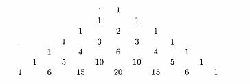

# **Pascal's Triangle**
## Objective

- *Pascal's triangle* is a triangular array of numbers named in honour of the French mathematician Blaise Pascal. The first few rows of the triangle are:

 

- The triangle can be extended as far as we please. The values of the entries in any row can be obtained in a number of ways. One way is to note that, in any row, the first and last entries both have the value one while the value of each interior entry is the sum of the values in the row above it, to its left and right. As examples, in the last row shown, 6 = 1 + 5 and 15 = 5 + 10. The values can also be obtained without reference to other values. If we let the symbol  represent the number of ways of choosing r items from n different items, then the entries in the first few rows of Pascal's triangle are:

 

- The value of  can be calculated using the formula:

 

- where the symbol n! is read as n factorial. The value of n! can be found using the formula:

 

- Write a program that prints portions of Pascal's triangle. The program should repeatedly ask the user to supply the number of rows in the triangle, terminating when the user supplies the value zero. In printing a triangle, the first value in the last row should appear in the first column and each preceding row should start printing three spaces further right. The number of spaces between entries in a row should be adjusted so that values are aligned correctly from row to row. For example, if the user supplies input of 7, the program should print the following triangle. In the bottom row of the triangle, there are five spaces between the first 1 and the first 6 but only four spaces between the first 6 and the first 15. In this way, the last digit of 15 is aligned with the 4 and 1 above it.

 

- Your program should be able to print up to twenty rows of Pascal's triangle. (Larger triangles contain entries that are more than five digits long; they will not fit in the format specified for the problem.) If a user specifies a number of rows greater than twenty or less than zero, the program should reject the value gracefully. For large triangles, your output device may not be able to print all the characters in some rows on a single line. In such cases, the output of one row will automatically wrap around to the next line. Do not worry about this behaviour.

---

- Has In.java
- Used Java version 1.2 ~~(*is updated though*)~~

  

***Made on September 22nd, 2023***\
***By: Aaron Prince Anu***

*Temporary?*